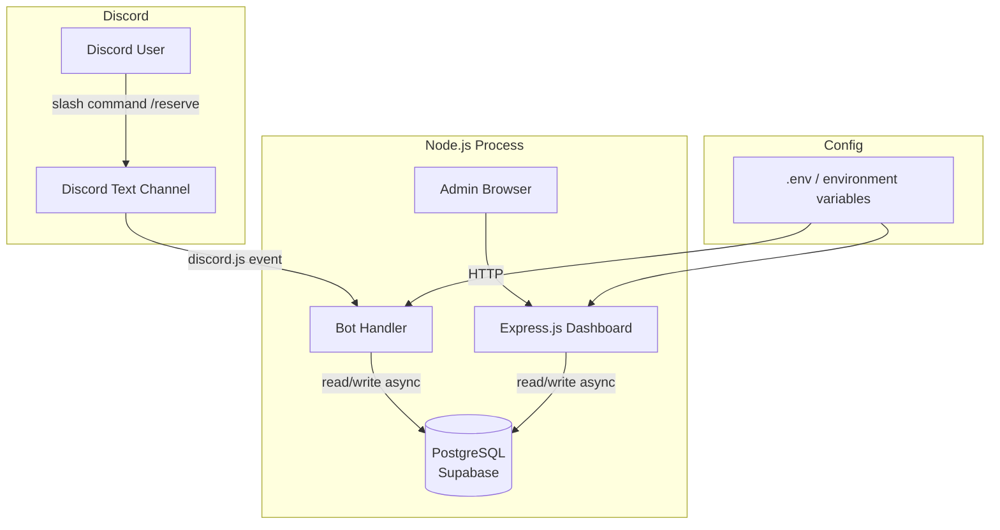
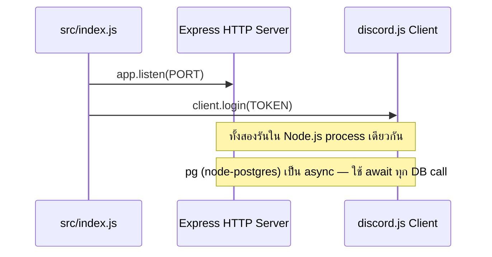

# เอกสารออกแบบ (Design Document)
# Discord Reservation Bot พร้อม Web Dashboard

## Overview

ระบบประกอบด้วยสองส่วนหลักที่ทำงานใน Node.js process เดียวกัน:

1. **Discord Bot** — รับคำสั่งจองจากผู้ใช้ใน Text Channel ผ่าน slash commands (`/reserve`) โดยใช้ `discord.js` v14
2. **Web Dashboard** — หน้าเว็บสำหรับ Admin จัดการ Page, Item, Reservation, History และ Whitelist โดยใช้ `Express.js` + `EJS` templates (SSR)

ทั้งสองส่วนแชร์ฐานข้อมูล **PostgreSQL บน Supabase** ผ่าน `pg` (node-postgres) ซึ่งเป็น async driver รองรับ connection pooling ผ่าน PgBouncer

Bot และ Dashboard รันใน Node.js process เดียวกัน โดย Express HTTP server และ discord.js client ถูก start พร้อมกันใน `src/index.js`

---

## Architecture



### การรันพร้อมกัน



---

## Components and Interfaces

### 1. Bot Commands (`src/bot/commands/`)

| Command | Parameters | Description |
|---------|-----------|-------------|
| `/reserve` | `page: Integer`, `item: Integer` | จอง Item เดียว |
| `/reserve` | `page: Integer` | จองทั้งหน้า (ไม่ระบุ item) |
| `/available` | — | แสดง Item ที่ว่างพร้อม interactive components สำหรับจอง |
| `/mystuff` | — | แสดง Item ที่ผู้ใช้จองไว้ในรอบปัจจุบัน (ephemeral) |

Bot ใช้ `discord.js` SlashCommandBuilder และ `interactionCreate` event

**Response flow — /reserve:**
```
User → /reserve page=1 item=2
  → validate page/item exists
  → ตรวจสอบ ItemType ของ item ที่จะจอง
  → ถ้า ItemType เป็น Album → ตรวจสอบ Whitelist (Discord Username)
  → ถ้าไม่อยู่ใน Whitelist → reply ephemeral "ไม่มีสิทธิ์จองAlbum"
  → ถ้า ItemType เป็น light-dark/time-space → ข้ามการตรวจ Whitelist
  → ตรวจสอบ ItemType (ถ้าจองทั้งหน้า)
  → check reservation status
  → write to DB (if available)
  → reply in same channel
```

**Response flow — /available:**
```
User → /available
  → getAvailableItems(roundId)
  → ถ้าไม่มี item ว่าง → reply "เต็มหมดแล้ว"
  → สร้าง Discord Embed + Buttons/Select Menu สำหรับแต่ละ item ว่าง
  → reply embed พร้อม interactive components

User → กดปุ่ม/เลือก item จาก component
  → ตรวจสอบ ItemType ของ item ที่เลือก
  → ถ้า ItemType เป็น Album → ตรวจสอบ Whitelist (Discord Username)
  → ถ้าไม่อยู่ใน Whitelist → reply ephemeral "ไม่มีสิทธิ์จองAlbum"
  → ถ้า ItemType เป็น light-dark/time-space → ข้ามการตรวจ Whitelist
  → check reservation status (อาจถูกจองไปแล้วระหว่างรอ)
  → write to DB (if available)
  → reply ผลการจอง
```

**Response flow — /mystuff:**
```
User → /mystuff
  → getMyReservations(discordUsername, roundId)
  → ถ้าไม่มีการจอง → reply ephemeral "ยังไม่มีการจอง"
  → สร้าง embed แสดงรายการ item ที่จอง (page, item name, item type)
  → reply ephemeral
```

### 2. Web Dashboard (`src/web/`)

| Route | Method | Description |
|-------|--------|-------------|
| `GET /login` | GET | หน้า Login |
| `POST /login` | POST | ตรวจสอบ Discord User ID |
| `POST /logout` | POST | ยกเลิก Session |
| `GET /` | GET | Dashboard หลัก (redirect ถ้าไม่ได้ login) |
| `GET /pages` | GET | จัดการ Pages |
| `POST /pages` | POST | เพิ่ม Page |
| `POST /pages/:id/delete` | POST | ลบ Page |
| `GET /pages/:id/items` | GET | รายการ Items ใน Page |
| `POST /pages/:id/items` | POST | เพิ่ม Item (พร้อม ItemType) |
| `POST /items/:id/delete` | POST | ลบ Item |
| `GET /reservations` | GET | รายการ Reservations รอบปัจจุบัน |
| `POST /reservations` | POST | เพิ่ม Reservation (Admin) |
| `POST /reservations/:id/delete` | POST | ลบ Reservation |
| `GET /history` | GET | ประวัติการจองแยก Round |
| `POST /history/:roundId/delete` | POST | ลบ History ของ Round |
| `POST /history/delete-all` | POST | ลบ History ทั้งหมด |
| `GET /whitelist` | GET | รายชื่อ Whitelist |
| `POST /whitelist` | POST | เพิ่มรายชื่อใน Whitelist |
| `POST /whitelist/:id/delete` | POST | ลบรายชื่อออกจาก Whitelist |
| `GET /presets` | GET | รายการ Presets |
| `POST /presets` | POST | สร้าง Preset ใหม่ |
| `POST /presets/:id/edit` | POST | แก้ไข Preset |
| `POST /presets/:id/delete` | POST | ลบ Preset |

> หมายเหตุ: ใช้ `POST` แทน `DELETE` เพื่อรองรับ HTML form ใน EJS templates (SSR)

### 3. Database Layer (`src/db/`)

- `src/db/database.js` — เปิด `pg.Pool` connection กับ Supabase, helper `toPostgres()` แปลง `?` → `$1,$2,...`, export `db.all/get/run/exec`
- `src/db/queries.js` — SQL query functions แยกตาม domain (pages, items, reservations, whitelist, presets)

**Query functions ใหม่สำหรับ /available และ /mystuff:**

```js
/**
 * ดึง Item ทั้งหมดที่ยังว่างอยู่ในรอบปัจจุบัน
 * @param {number} roundId
 * @returns {{ id, page_id, page_name, name, item_type, position }[]}
 */
function getAvailableItems(roundId) { /* ... */ }

/**
 * ดึง Reservation ทั้งหมดของผู้ใช้ในรอบปัจจุบัน
 * @param {string} discordUsername
 * @param {number} roundId
 * @returns {{ item_id, page_name, item_name, item_type }[]}
 */
function getMyReservations(discordUsername, roundId) { /* ... */ }
```

### 4. Auth Middleware (`src/web/middleware/auth.js`)

Session-based authentication โดยใช้ `express-session` + `connect-pg-simple` เก็บ session ใน PostgreSQL ตรวจสอบ Discord User ID กับตาราง `admin_users` ใน Database

---

## Data Models

### Schema ฐานข้อมูล PostgreSQL (Supabase)

```sql
-- Admin Users
CREATE TABLE IF NOT EXISTS admin_users (
    id              SERIAL PRIMARY KEY,
    discord_user_id TEXT NOT NULL UNIQUE,
    created_at      TIMESTAMPTZ NOT NULL DEFAULT NOW()
);

-- Pages
CREATE TABLE IF NOT EXISTS pages (
    id         SERIAL PRIMARY KEY,
    name       TEXT NOT NULL,
    created_at TIMESTAMPTZ NOT NULL DEFAULT NOW()
);

-- Items (สูงสุด 4 ชิ้นต่อ Page)
-- item_type: 'Album' | 'light-dark' | 'time-space'
CREATE TABLE IF NOT EXISTS items (
    id         SERIAL PRIMARY KEY,
    page_id    INTEGER NOT NULL REFERENCES pages(id) ON DELETE CASCADE,
    item_type  TEXT NOT NULL CHECK (item_type IN ('Album', 'light-dark', 'time-space')),
    position   INTEGER NOT NULL CHECK (position BETWEEN 1 AND 4),
    created_at TIMESTAMPTZ NOT NULL DEFAULT NOW(),
    UNIQUE (page_id, position)
);

-- Rounds
CREATE TABLE IF NOT EXISTS rounds (
    id         SERIAL PRIMARY KEY,
    name       TEXT NOT NULL,
    status     TEXT NOT NULL DEFAULT 'preparing' CHECK (status IN ('preparing', 'open', 'closed')),
    created_at TIMESTAMPTZ NOT NULL DEFAULT NOW()
);

-- Reservations
CREATE TABLE IF NOT EXISTS reservations (
    id               SERIAL PRIMARY KEY,
    round_id         INTEGER NOT NULL REFERENCES rounds(id) ON DELETE CASCADE,
    item_id          INTEGER NOT NULL REFERENCES items(id) ON DELETE CASCADE,
    discord_user_id  TEXT NOT NULL,
    discord_username TEXT NOT NULL,
    reserved_at      TIMESTAMPTZ NOT NULL DEFAULT NOW(),
    UNIQUE (round_id, item_id)
);

-- Whitelist
CREATE TABLE IF NOT EXISTS whitelist (
    id               SERIAL PRIMARY KEY,
    discord_username TEXT NOT NULL UNIQUE,
    discord_user_id  TEXT,
    created_at       TIMESTAMPTZ NOT NULL DEFAULT NOW()
);

-- Round History Items (Snapshot)
CREATE TABLE IF NOT EXISTS round_history_items (
    id               SERIAL PRIMARY KEY,
    round_id         INTEGER NOT NULL REFERENCES rounds(id) ON DELETE CASCADE,
    page_name        TEXT NOT NULL,
    item_type        TEXT NOT NULL,
    item_pos         INTEGER NOT NULL,
    discord_user_id  TEXT,
    discord_username TEXT,
    reserved_at      TIMESTAMPTZ
);

-- Item Presets
CREATE TABLE IF NOT EXISTS item_presets (
    id               SERIAL PRIMARY KEY,
    name             TEXT NOT NULL UNIQUE,
    album_count      INTEGER NOT NULL DEFAULT 0 CHECK (album_count >= 0),
    light_dark_count INTEGER NOT NULL DEFAULT 0 CHECK (light_dark_count >= 0),
    time_space_count INTEGER NOT NULL DEFAULT 0 CHECK (time_space_count >= 0),
    created_at       TIMESTAMPTZ NOT NULL DEFAULT NOW(),
    CHECK (album_count + light_dark_count + time_space_count BETWEEN 1 AND 4)
);
```

### JavaScript Data Structures

```js
// Page
/** @typedef {{ id: number, name: string, created_at: string, item_count: number }} Page */

// Item
/** @typedef {{ id: number, page_id: number, name: string, item_type: 'Album'|'light-dark'|'time-space', position: number, created_at: string, reserved_by: string|null }} Item */

// Reservation
/** @typedef {{ id: number, round_id: number, item_id: number, discord_user_id: string, discord_username: string, reserved_at: string, page_name: string, item_name: string, item_type: string }} Reservation */

// Round
/** @typedef {{ id: number, name: string, created_at: string, reservation_count: number }} Round */

// AdminUser
/** @typedef {{ id: number, discord_user_id: string, created_at: string }} AdminUser */

// WhitelistEntry
/** @typedef {{ id: number, discord_username: string, discord_user_id: string|null, created_at: string }} WhitelistEntry */

// ItemPreset
/** @typedef {{ id: number, name: string, card_count: number, white_feather_count: number, black_feather_count: number, created_at: string }} ItemPreset */
```

### โครงสร้างโปรเจ็ค

```
discord-reservation-bot/
├── src/
│   ├── index.js                 # entry point — start bot + express พร้อมกัน
│   ├── config.js                # อ่านและ validate environment variables
│   ├── bot/
│   │   ├── client.js            # discord.js Client setup + event registration
│   │   ├── deploy-commands.js   # register slash commands กับ Discord API
│   │   └── commands/
│   │       └── reserve.js       # /reserve command handler
│   ├── web/
│   │   ├── app.js               # Express app instance + middleware setup
│   │   ├── middleware/
│   │   │   └── auth.js          # session auth middleware
│   │   ├── routes/
│   │   │   ├── auth.js          # login/logout routes
│   │   │   ├── pages.js         # page management routes
│   │   │   ├── items.js         # item management routes
│   │   │   ├── reservations.js  # reservation management routes
│   │   │   ├── history.js       # history routes
│   │   │   ├── whitelist.js     # whitelist management routes
│   │   │   └── presets.js       # preset management routes
│   │   └── views/               # EJS templates
│   │       ├── layout.ejs
│   │       ├── login.ejs
│   │       ├── dashboard.ejs
│   │       ├── pages.ejs
│   │       ├── items.ejs
│   │       ├── reservations.ejs
│   │       ├── history.ejs
│   │       ├── whitelist.ejs
│   │       └── presets.ejs
│   └── db/
│       ├── database.js          # open connection, WAL mode, schema init
│       └── queries.js           # SQL query functions
├── tests/
│   ├── unit/
│   │   ├── reserve.test.js      # bot command logic
│   │   ├── queries.test.js      # DB query functions
│   │   └── config.test.js       # config validation
│   └── property/
│       ├── reservation.prop.test.js
│       ├── pageItem.prop.test.js
│       ├── whitelist.prop.test.js
│       └── history.prop.test.js
├── .env.example
├── package.json
└── jest.config.js
```

---

## Correctness Properties

*A property is a characteristic or behavior that should hold true across all valid executions of a system — essentially, a formal statement about what the system should do. Properties serve as the bridge between human-readable specifications and machine-verifiable correctness guarantees.*

### Property 1: Reservation write correctness

*For any* available item and any Discord user in the whitelist, calling `reserveItem()` should result in that item being marked as reserved by that user in the database, and subsequent calls for the same item should return a conflict error without modifying the reservation.

**Validates: Requirements 1.3, 3.2, 3.3**

---

### Property 2: Bulk reservation only reserves available items

*For any* page where all items have ItemType `light-dark` or `time-space`, and the page has a random mix of available and already-reserved items, calling `reservePage()` should reserve exactly the items that were available before the call, leaving already-reserved items unchanged.

**Validates: Requirements 1.4, 1.8, 1.9**

---

### Property 3: Bulk reservation blocked when page contains Album

*For any* page that contains at least one item with ItemType `Album`, calling `reservePage()` should return a rejection error and make no changes to the database.

**Validates: Requirements 1.5, 8.4**

---

### Property 4: Response messages contain required information

*For any* reservation result (success or conflict), the formatted response message should contain the Discord username of the relevant user and the name of the item involved.

**Validates: Requirements 1.6, 1.7**

---

### Property 5: Invalid page or item returns not-found error

*For any* page ID or item ID that does not exist in the database, calling `reserveItem()` or `reservePage()` should return a not-found error and make no changes to the database.

**Validates: Requirements 1.10**

---

### Property 6: Whitelist check blocks non-whitelisted users

*For any* Discord username that does not exist in the whitelist table, calling `isWhitelisted(username)` should return false, and the bot command handler should return a rejection response without writing any reservation to the database.

**Validates: Requirements 1.1, 1.2, 9.6**

---

### Property 7: Whitelist add round-trip

*For any* valid Discord username, calling `addToWhitelist(username)` followed by `isWhitelisted(username)` should return true. Calling `removeFromWhitelist(id)` should then make `isWhitelisted(username)` return false.

**Validates: Requirements 9.2, 9.3**

---

### Property 8: Whitelist duplicate rejected

*For any* Discord username already in the whitelist, calling `addToWhitelist(username)` again should return a duplicate error and the whitelist count should remain unchanged.

**Validates: Requirements 9.5**

---

### Property 9: ItemType constraint enforced at DB level

*For any* string value that is not one of `Album`, `light-dark`, `time-space`, attempting to insert an item with that value should throw a constraint error and no item should be added to the database.

**Validates: Requirements 8.1, 8.6**

---

### Property 10: Page item count accuracy

*For any* set of pages with varying numbers of items, `getAllPages()` should return each page with an `item_count` that exactly matches the number of items associated with that page in the database.

**Validates: Requirements 2.1**

---

### Property 11: Page add round-trip

*For any* valid page name, calling `addPage(name)` followed by `getAllPages()` should return a list that includes a page with that name.

**Validates: Requirements 2.2**

---

### Property 12: Page delete cascades to items and reservations

*For any* page that has items and reservations, calling `deletePage(id)` should remove the page, all its items, and all reservations associated with those items from the database.

**Validates: Requirements 2.3**

---

### Property 13: Item status reflects reservation state

*For any* set of items with varying reservation states, `getItemsForPage(pageId)` should return each item with a `reserved_by` field that is non-null if and only if that item has an active reservation in the current round.

**Validates: Requirements 2.4, 3.5**

---

### Property 14: Item add round-trip (page not full)

*For any* page with fewer than 4 items, calling `addItem()` with a valid ItemType followed by `getItemsForPage()` should return a list that includes the newly added item with the correct `item_type`.

**Validates: Requirements 2.5, 8.2**

---

### Property 15: Full page rejects new items

*For any* page that already has exactly 4 items, calling `addItem()` should return a "page full" error and the item count for that page should remain 4.

**Validates: Requirements 2.6**

---

### Property 16: Item delete cascades to reservations

*For any* item that has an associated reservation, calling `deleteItem(id)` should remove both the item and its reservation from the database.

**Validates: Requirements 2.7**

---

### Property 17: Reservation data completeness

*For any* reservation created via `addReservation()`, querying that reservation back from the database should return a record with all required fields non-null: `reserved_at`, `discord_user_id`, `discord_username`, `page_name`, `item_name`, `item_type`, and `round_id`.

**Validates: Requirements 4.1**

---

### Property 18: History grouped by round with correct counts

*For any* set of reservations distributed across multiple rounds, `getHistoryByRound()` should return each round containing only its own reservations, and the `reservation_count` for each round should match the actual number of reservations in that round.

**Validates: Requirements 4.2, 4.5**

---

### Property 19: Delete history removes only targeted reservations

*For any* set of rounds with reservations, calling `deleteRoundHistory(roundId)` should remove all reservations for that round while leaving all other rounds' reservations intact. Calling `deleteAllHistory()` should result in an empty reservations table.

**Validates: Requirements 4.3, 4.4**

---

### Property 20: Protected routes require authentication

*For any* protected route path, making an HTTP request without a valid session cookie should result in a redirect response to `/login`.

**Validates: Requirements 5.1**

---

### Property 21: Valid admin ID creates session

*For any* Discord User ID that exists in the `admin_users` table, calling the login endpoint with that ID should return a response with a valid session cookie set.

**Validates: Requirements 5.2, 5.4**

---

### Property 22: Invalid admin ID is rejected

*For any* Discord User ID that does not exist in the `admin_users` table, calling the login endpoint should return an error response with no session cookie set.

**Validates: Requirements 5.3**

---

### Property 23: Logout clears session

*For any* authenticated session, calling the logout endpoint should invalidate the session such that subsequent requests to protected routes redirect to `/login`.

**Validates: Requirements 5.5**

---

### Property 24: Query filtering correctness

*For any* set of reservations, querying by `round_id`, `page_id`, `item_id`, or `discord_user_id` should return exactly the reservations that match the given filter and no others.

**Validates: Requirements 6.4**

---

### Property 25: Missing config reports missing keys

*For any* subset of required environment variables that is missing, calling `validateConfig()` should throw an error whose message contains the name of each missing variable.

**Validates: Requirements 7.5**

---

### Property 26: getAvailableItems returns only unreserved items

*For any* round with a mix of reserved and unreserved items, calling `getAvailableItems(roundId)` should return exactly the items that have no reservation in that round — no reserved items should appear in the result, and no available items should be omitted.

**Validates: Requirements 10.1, 10.2**

---

### Property 27: Whitelist check enforced on /available interaction

*For any* Discord username that does not exist in the whitelist, attempting to reserve an item via the `/available` interactive component should return a rejection response without writing any reservation to the database.

**Validates: Requirements 10.4, 10.5**

---

### Property 28: /available interaction handles race condition correctly

*For any* item that becomes reserved between the time `/available` is displayed and the time a user clicks the button, the interaction handler should detect the conflict and return an error response without creating a duplicate reservation.

**Validates: Requirements 10.7**

---

### Property 29: getMyReservations returns only the requesting user's reservations

*For any* round with reservations from multiple users, calling `getMyReservations(discordUsername, roundId)` should return exactly the reservations belonging to that username — no other user's reservations should appear, and none of the user's own reservations should be omitted.

**Validates: Requirements 11.1, 11.2**

---

### Property 30: Whitelist check skipped for ขนนก items

*For any* Discord username that does not exist in the whitelist, attempting to reserve an item with ItemType `light-dark` or `time-space` should succeed (assuming the item is available) without any whitelist lookup being performed.

**Validates: Requirements 12.1, 12.4**

---

### Property 31: Whitelist check enforced only for Album items

*For any* Discord username that does not exist in the whitelist, attempting to reserve an item with ItemType `Album` should return a rejection response without writing any reservation to the database.

**Validates: Requirements 12.2, 12.3, 12.5, 12.6**

---

### Property 32: Preset total item count constraint

*For any* combination of card_count, white_feather_count, and black_feather_count where the sum exceeds 4 or equals 0, attempting to insert a preset with those values should throw a constraint error and no preset should be added to the database.

**Validates: Requirements 13.3, 13.4**

---

### Property 33: Preset add round-trip

*For any* valid preset (name unique, total items 1–4), calling `addPreset()` followed by `getAllPresets()` should return a list that includes the newly added preset with the correct item counts.

**Validates: Requirements 13.2**

---

### Property 34: Preset name uniqueness enforced

*For any* preset name already in the database, calling `addPreset()` with the same name should return a duplicate error and the preset count should remain unchanged.

**Validates: Requirements 13.11**

---

### Property 35: Page creation with preset creates correct items

*For any* valid preset, calling `createPageWithPreset(pageName, presetId)` should create a page and add exactly the number of items specified in the preset (card_count Album items, white_feather_count light-dark items, black_feather_count time-space items), all in a single atomic transaction.

**Validates: Requirements 13.7, 13.8**

---

## Error Handling

### Bot Error Handling

| Scenario | Response |
|----------|----------|
| ผู้ใช้ไม่อยู่ใน Whitelist และจอง Album | ตอบกลับ ephemeral message "คุณไม่มีสิทธิ์จองAlbum" |
| จองทั้งหน้าที่มีAlbum | ตอบกลับ ephemeral message แจ้งให้ระบุชิ้น |
| Page ไม่พบ | ตอบกลับ ephemeral message "ไม่พบ Page ที่ระบุ" |
| Item ไม่พบ | ตอบกลับ ephemeral message "ไม่พบ Item ที่ระบุ" |
| Item ถูกจองแล้ว | ตอบกลับพร้อมชื่อผู้จองเดิม |
| ทุก Item ในหน้าถูกจองหมด | ตอบกลับพร้อมรายชื่อผู้จองทุก Item |
| /available — ไม่มี Item ว่างเลย | ตอบกลับ "ทุก Item ถูกจองหมดแล้ว" |
| /available interaction — ผู้ใช้ไม่อยู่ใน Whitelist และจอง Album | ตอบกลับ ephemeral "คุณไม่มีสิทธิ์จองAlbum" |
| /available interaction — Item ถูกจองไปแล้ว (race condition) | ตอบกลับ ephemeral แจ้ง Item นั้นถูกจองแล้ว |
| /mystuff — ยังไม่มีการจองในรอบนี้ | ตอบกลับ ephemeral "ยังไม่มีการจองในรอบนี้" |
| DB error | log error, ตอบกลับ "เกิดข้อผิดพลาด กรุณาลองใหม่" |

### Web Dashboard Error Handling

| Scenario | Response |
|----------|----------|
| ไม่ได้ login | Redirect ไป `/login` |
| Discord User ID ไม่มีสิทธิ์ | แสดง error message บนหน้า login |
| เพิ่ม Item โดยไม่ระบุ ItemType | HTTP 400 + error message |
| ItemType ไม่ถูกต้อง | HTTP 400 + error message |
| เพิ่ม Item ในหน้าที่เต็ม | HTTP 400 + error message |
| จอง Item ที่ถูกจองแล้ว | HTTP 409 + error message |
| เพิ่ม Whitelist ซ้ำ | HTTP 409 + error message |
| ลบ resource ที่ไม่มีอยู่ | HTTP 404 |
| สร้าง Preset ที่มี Items รวมเกิน 4 ชิ้น | HTTP 400 + error message |
| สร้าง Preset ชื่อซ้ำ | HTTP 409 + error message |
| ลบ Preset ที่ไม่มีอยู่ | HTTP 404 |
| DB error | HTTP 500 + generic error message, log full error |

### Database Error Handling

- ใช้ `pg` (node-postgres) Pool — async/await ทุก query
- Connection string จาก Supabase พร้อม `ssl: { rejectUnauthorized: false }`
- PostgreSQL unique violation error code: `23505` — ใช้ตรวจ duplicate reservation
- ใช้ `db.pool` สำหรับ transaction เมื่อต้องการ atomicity

---

## Testing Strategy

### Dual Testing Approach

ระบบใช้ทั้ง unit tests และ property-based tests ร่วมกัน:

- **Unit tests**: ตรวจสอบ specific examples, edge cases, error conditions
- **Property-based tests**: ตรวจสอบ universal properties ด้วย random inputs (minimum 100 iterations)

### Testing Libraries

```bash
npm install --save-dev jest fast-check
```

- **Jest** — test runner และ assertion library
- **fast-check** — property-based testing library สำหรับ JavaScript/TypeScript
- **pg** — ใช้ test database บน Supabase หรือ local PostgreSQL

### Property Test Configuration

```js
const fc = require('fast-check');

test('Property N: <property_text>', () => {
  // Feature: discord-reservation-bot, Property N: <property_text>
  fc.assert(
    fc.property(fc.string({ minLength: 1 }), (input) => {
      // ...
    }),
    { numRuns: 100 }
  );
});
```

### Test Structure

```
tests/
├── unit/
│   ├── reserve.test.js          # bot command logic (whitelist check, item type rules)
│   ├── queries.test.js          # DB query functions
│   └── config.test.js           # config validation
└── property/
    ├── reservation.prop.test.js  # Properties 1-5, 26-29
    ├── whitelist.prop.test.js    # Properties 6-8, 30-31
    ├── itemType.prop.test.js     # Property 9
    ├── pageItem.prop.test.js     # Properties 10-16
    ├── history.prop.test.js      # Properties 17-19
    ├── auth.prop.test.js         # Properties 20-23
    ├── query.prop.test.js        # Properties 24-25
    └── preset.prop.test.js       # Properties 32-35
```

### Unit Test Focus Areas

- Bot command parsing (valid/invalid inputs)
- Whitelist check logic (username matching)
- ItemType validation (Album blocks page reservation)
- Message formatting functions
- Session cookie creation/validation
- Config validation with missing variables

### Smoke Tests (ใน unit tests)

- DB file created in project directory on first run
- All required tables exist after `initDb()`
- System starts with all required env vars
- System fails with clear message when env vars missing
